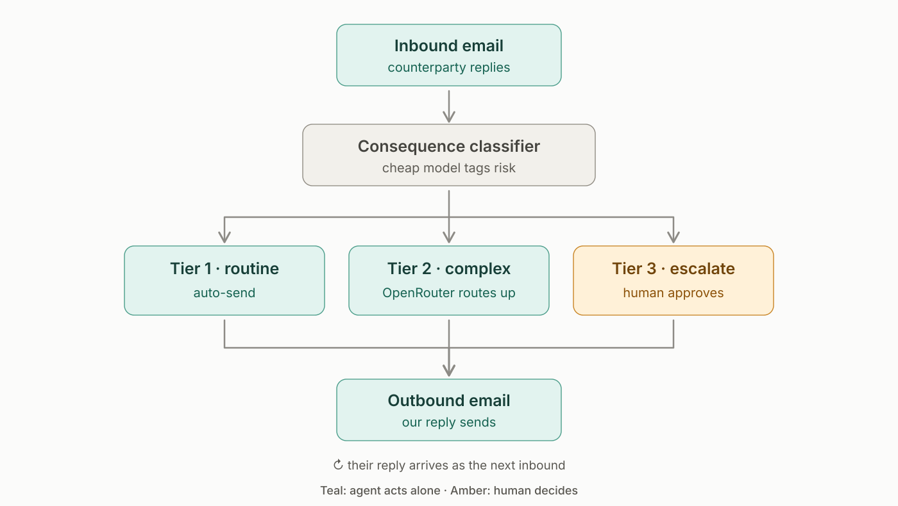

# Port 25

<p align="center">
  
</p>

Two AI agents at different organisations negotiate a supply contract by real
email — not an API, not a shared agent protocol. Email is the one
interoperability layer every company already has: its own authentication,
threading, and audit trail, solved in 1982. A human supervises through a
console and steers by moving a **mandate** (a walk-away price and a max lead
time), not by reading every message. Every inbound email is tagged
`routine` / `complex` / `escalate` by a cheap classifier; that tag decides
both which model drafts the reply *and* whether a human gets interrupted.
The mandate check itself is plain Python, not a model decision — a model can
never talk itself into sending an offer worse than the floor.

This README describes what the repository actually does today, verified
against the code, not the original pitch. Where something is stubbed,
unused, or broken, it says so.

---

## State of the project

| Piece | Status |
|---|---|
| Negotiation loop, tiered routing, mandate enforcement | Implemented (`backend/app/loop.py`, `state.py`) |
| Classifier + drafting via OpenRouter | Implemented (`backend/app/brain/`) |
| Exa market context (single fetch, and refreshed on `complex` turns) | Implemented (`backend/app/brain/context.py`) |
| Mock transport (in-memory scripted counterparty) | Implemented, always works, no credentials |
| SMTP/IMAP transport (real Gmail-style inboxes) | Implemented (`backend/app/transport/smtp_imap.py`) |
| Two-inbox automatic demo (`demo_pair.py`) with commodity/region selection | Implemented |
| Ambiguous AI transport | **Stub only** — `send()`/`poll()` raise `NotImplementedError`. Selecting `PORT25_TRANSPORT=ambiguous` will not work. |
| `OPENAI_API_KEY` | Present in config but currently **unused** — every entry in the routing table goes through OpenRouter (`via_openrouter=True`), including the "cheap" tier. |
| Auth0, CopilotKit | Not integrated anywhere in this codebase. |
| Static console (`web/index.html`) | Implemented, zero-build, served by FastAPI itself |
| Next.js console (`web/next/`) | Implemented — plain Next.js 16 + React 19, no CopilotKit dependency. Has a Playwright test suite. |
| Backend test suite (`pytest`) | 76 tests, all passing as of this writing |
| `test_classifier.py` (6 bundled fixtures) | **2/6 passing** — see [Known limitations](#known-limitations) |

---

## How it works

### Two operating modes

The backend supports two distinct ways of running a negotiation, chosen by
environment variables, not by different code paths in the console:

**1. Single-agent loop** (`app/loop.py`) — the default. One transport (mock,
smtp, or the unimplemented ambiguous) plays *our* side; a scripted or human
counterparty plays the other. The scenario is hardcoded: EUR, "per unit",
electronic components. Every inbound email goes through
`classify()` → `draft_reply()` → send-or-park, exactly once per email.

**2. Two-inbox demo** (`app/demo_pair.py`, `PORT25_DEMO_PAIR=true`) — one
backend process owns *two* real inboxes (via SMTP/IMAP) and plays both the
buyer and the supplier automatically. Commodity (aluminium / copper / steel),
buyer region, and supplier region are chosen at negotiation start. Pricing is
governed by an explicit, code-bounded policy in `demo_pair.py` — a model
never sets a number. Set `PORT25_DEMO_AI=true` to additionally let OpenRouter
classify supplier replies and write a single constrained courtesy sentence
per email (`app/brain/demo_drafting.py`), and let Exa produce a structured
market brief (`app/brain/context.py::research_commodity_market`) that sets
the opening target/floor/ask. With `PORT25_DEMO_AI=false` this mode needs no
model API keys at all.

### Tiered routing (mode 1)

| Tier | Meaning | What happens |
|---|---|---|
| `routine` | counterparty restated or conceded within known terms | fast model drafts, sends itself |
| `complex` | they introduced a new argument or trade-off | stronger model, still sends itself |
| `escalate` | outside the mandate, or a structural/legal change | drafted and parked for a human |

The routing table (`app/brain/router.py`) is a plain dict, not a model
decision:

```python
ROUTINE:  ("openai/gpt-4o-mini",        via OpenRouter)
COMPLEX:  ("anthropic/claude-sonnet-4.5", via OpenRouter)
ESCALATE: ("anthropic/claude-sonnet-4.5", via OpenRouter)
```

`state.py::Negotiation.is_within_mandate()` is the one rule that isn't a
model decision. The classifier can raise a turn to `escalate`; it can never
lower one, no matter what a model returns.

---

## Setup

Requires Python 3.12 and (for the Next.js console) Node.js.

```bash
git clone <this repo> && cd port25

# .env lives at the REPO ROOT, not backend/.env — backend/app/__init__.py's
# load_dotenv() resolves it as three directories up from itself, i.e. here.
cp .env.example .env
# fill in whichever keys you have; everything degrades gracefully (see below)

cd backend
python -m venv .venv && source .venv/bin/activate
pip install -r requirements.txt

python run_demo.py                       # smoke test against the mock transport, no keys needed
uvicorn app.main:app --reload --port 8000
```

Open `http://localhost:8000` for the static console (`web/index.html`,
mounted by FastAPI itself). For the Next.js console instead:

```bash
cd web/next
cp .env.example .env.local
npm install
npm run dev
```

Open `http://localhost:3000`; see [`web/next/README.md`](web/next/README.md)
for what that console shows and its `NEXT_PUBLIC_PORT25_API` setting.

---

## Configuration reference

Everything below lives in the repo-root `.env` (copy from `.env.example`).
Nothing here is required to see the loop run — the mock transport and stub
model output work with zero keys.

| Variable | Purpose | If unset |
|---|---|---|
| `PORT25_TRANSPORT` | `mock` (default), `smtp`, or `ambiguous` (unimplemented) | defaults to `mock` |
| `OPENAI_API_KEY` | accepted by `llm.py` for a non-OpenRouter call path | **currently dead** — nothing in the routing table uses it |
| `OPENROUTER_API_KEY` | required for real classifier/drafting output | model calls return a labelled stub string; the loop still runs |
| `EXA_API_KEY` | market context and the two-inbox demo's market brief | market context is blank; demo pricing falls back to a hardcoded benchmark |
| `PORT25_DEMO_AI` | `true` to let OpenRouter classify/word the two-inbox demo | `false` — that mode runs on fixed rules only |
| `AMBIGUOUS_API_KEY`, `AMBIGUOUS_OUR_AGENT_ID`, `AMBIGUOUS_THEIR_AGENT_ID` | read by the Ambiguous transport stub | irrelevant until that transport is implemented |
| `OUR_EMAIL`, `OUR_EMAIL_APP_PASSWORD` | primary inbox for `smtp` transport | `smtp` transport refuses to start |
| `COUNTERPARTY_EMAIL`, `COUNTERPARTY_EMAIL_APP_PASSWORD` | second inbox, required for `PORT25_DEMO_PAIR=true` | two-inbox demo refuses to start |
| `SMTP_HOST` / `SMTP_PORT`, `IMAP_HOST` / `IMAP_PORT` | mail server settings, default to Gmail | Gmail defaults apply |
| `COUNTERPARTY_SMTP_HOST` / `..._PORT`, `COUNTERPARTY_IMAP_HOST` / `..._PORT` | override the second inbox's server if it's a different provider | falls back to the primary account's settings |
| `PORT25_DEMO_PAIR` | `true` to run the two-inbox automatic demo | `false` — regular single-agent loop |

For Gmail, an app password requires 2-Step Verification
([setup guide](https://support.google.com/accounts/answer/185833)).

---

## Testing

```bash
cd backend
python -m pytest -q          # 76 tests: main.py endpoints, demo_pair, demo_ai
                              # wording guard, .env loading, smtp/imap transport
python run_demo.py           # scripted mock-transport negotiation, prints the thread
python test_classifier.py    # checks 6 bundled fixtures — see limitations below
```

For the SMTP transport specifically, `backend/smoke_smtp.py` checks
credentials and can send/receive a real test email without going through the
console — run `python smoke_smtp.py --help` for its flags, or `--pair` to
check both inboxes for the two-inbox demo.

---

## API

```
GET    /health                     transport status; in demo_pair mode also
                                    returns selectable accounts/commodities/regions
POST   /negotiation                start a thread. Body (all optional, only
                                    meaningful in demo_pair mode): buyer_account,
                                    supplier_account, commodity, buyer_region,
                                    supplier_region
GET    /negotiation                current state (both consoles poll this)
PATCH  /negotiation/mandate         move the floor/target/lead-time cap
POST   /negotiation/approve         send the parked draft, optionally edited
POST   /negotiation/reject          walk away / stop the demo
```

`PATCH`/`POST` mutating calls accept an optional `thread_id`; if it doesn't
match the current negotiation, the API returns 409 rather than mutating a
thread the caller can no longer see. There is no authentication on any
endpoint.

---

## Project layout

```
backend/app/state.py           Negotiation, Mandate, Tier, Status — the shared
                                data contract every other module reads/writes
backend/app/loop.py             single-agent loop: one inbound email in, one
                                outbound email or one human pause out
backend/app/demo_pair.py        two-inbox automatic demo, code-bounded pricing
backend/app/main.py             FastAPI app, in-memory single-negotiation state
backend/app/brain/              classifier, router, drafting, Exa context
backend/app/transport/          mock / smtp+imap (real) / ambiguous (stub)
backend/fixtures/               6 example inbound emails for the classifier
web/index.html                  static, zero-build console (FastAPI-served)
web/next/                       Next.js console with a Playwright test suite
```

There is one negotiation (or one `DemoPair`) held in a module-level global in
`main.py` — it does not persist across a restart, and running more than one
`uvicorn` worker will produce inconsistent state.

---

## Known limitations

- **Ambiguous AI transport is unimplemented.** `app/transport/ambiguous.py`
  raises `NotImplementedError` on both `send()` and `poll()`. Real API
  documentation for provisioning a coworker's mailbox and reading/sending
  through it was not available at the time this was scaffolded — only the
  coworker-provisioning endpoint shape was confirmed
  (`POST /api/admin/users/provision-agent`,
  `Authorization: Bearer ak_...`), and guessing the mail-specific endpoints
  risked shipping a transport that fails silently. Use `mock` or `smtp`.
- **`OPENAI_API_KEY` is dead code.** Every entry in `ROUTING_TABLE`
  (`app/brain/router.py`) sets `via_openrouter=True`, so `llm.py`'s
  OpenAI-direct path is never exercised. The variable is kept in
  `.env.example` for anyone who later routes a tier directly to OpenAI.
- **The default mandate doesn't match the single-agent demo's scripted
  counterparty.** `state.py::new_negotiation()` sets
  `floor_price_eur=12.50`, but the mock transport's (and the bundled
  classifier fixtures') opening counter-offer is `15.80 EUR` — above that
  floor. Because `is_within_mandate()` force-escalates any offer above the
  floor regardless of what the classifier itself decides, this means: (a)
  `python test_classifier.py` currently scores **2/6**, and (b) a
  single-agent-loop negotiation escalates to a human on the very first
  inbound reply instead of running the intended several autonomous rounds
  first. This does not affect the two-inbox demo (`demo_pair.py`), which
  computes its mandate dynamically from the Exa market brief rather than
  using this static default. Raising `floor_price_eur` (e.g. to `16.00`)
  fixes both symptoms, but that's a change to the shared state contract and
  hasn't been applied pending confirmation.
- **No authentication anywhere.** Any client that can reach the API can move
  the mandate, approve a draft, or start/stop a negotiation.
- **Single process, single negotiation.** State is an in-memory global; a
  restart loses it, and multiple workers will race on it.
